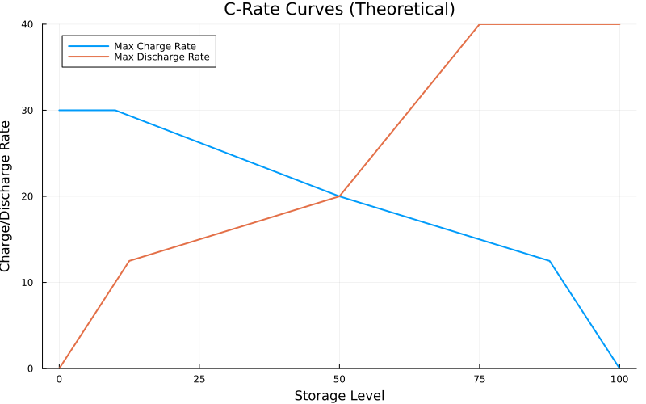

# [LevelDependentRateTES nodes](@id nodes-LDRTES)

The [`LevelDependentRateTES`](@ref) is the most advanced thermal energy storage node in
`EnergyModelsHeat`.
Like [`ThermalEnergyStorage`](@ref) and [`BoundRateTES`](@ref) it behaves mostly like a
[`RefStorage`](@extref EnergyModelsBase.RefStorage) with thermal energy losses that are
proportional to the storage level (see *[ThermalEnergyStorage nodes](@ref nodes-TES)* for the
description of the heat loss).
Its distinguishing feature is that the maximum charge and discharge rates depend on the
current *state of charge* of the storage.

In a real thermal energy storage the rate at which heat can be added or withdrawn is not
constant: charging typically slows down as the storage fills up, and discharging slows down as
it empties.
The [`LevelDependentRateTES`](@ref) captures this through user-provided **c-rate curves**: a
small number of `[level, rate]` anchor points that describe the maximum rate as a function of
the storage level at the end of the previous operational period.

!!! danger "Only operational models are supported"
    A [`LevelDependentRateTES`](@ref) can only be used together with an
    [`OperationalModel`](@extref EnergyModelsBase.OperationalModel).
    In an [`InvestmentModel`](@extref EnergyModelsBase.InvestmentModel) the installed storage,
    charge and discharge capacities become decision variables.
    The slopes and intercepts of the c-rate curves then depend on those capacity variables, so
    the rate limit would multiply a capacity variable by the storage-level variable.
    This product of two decision variables is a *bilinear* (nonconvex quadratic) term, which
    the linear and mixed-integer-linear solvers used in this package (*e.g.*, `HiGHS`) cannot
    handle.

!!! danger "StorageBehavior for LevelDependentRateTES"
    Like the other thermal energy storage nodes, a [`LevelDependentRateTES`](@ref) can only
    use [`Cyclic`](@extref EnergyModelsBase.Cyclic) storage behaviors, and when using
    `RepresentativePeriods` this is reduced to
    [`CyclicRepresentative`](@extref EnergyModelsBase.CyclicRepresentative).

## [Introduced type and its fields](@id nodes-LDRTES-fields)

[`LevelDependentRateTES`](@ref) uses the same standard fields as the other thermal energy
storage nodes (see *[ThermalEnergyStorage nodes](@ref nodes-TES-fields-stand)*): `id`,
`charge`, `level`, `discharge`, `stor_res`, `input`, `output` and `data`.
In addition it introduces the heat loss factor and the c-rate anchor points.

### [Additional fields](@id nodes-LDRTES-fields-new)

- **`heat_loss_factor::Float64`** :\
  The heat lost relative to the storage level of the previous operational period, given as a
  fraction in the range ``[0, 1]``.
  It corresponds to the loss occurring between two operational periods for a given operational
  duration of 1.

- **`c_rate_points_charge::Vector{<:Vector{<:Real}}`** and
  **`c_rate_points_discharge::Vector{<:Vector{<:Real}}`** :\
  One to three `[level, rate]` anchor points describing the maximum (dis-)charge rate as a
  function of the storage level.
  For **charging**, the curve starts at the point ``(0, capacity(charge(n)))`` (the full
  installed charge rate at an empty storage) and runs through the provided points in *strictly
  ascending* level order.
  For **discharging**, the curve starts at the point ``(capacity(level(n)), capacity(discharge(n)))``
  (the full installed discharge rate at a full storage) and runs through the provided points in
  *strictly descending* level order.
  All rates must be non-negative, the charge levels must lie in ``(0, capacity(level(n))]`` and
  the discharge levels in ``[0, capacity(level(n)))``.
  The number of anchor points sets the number of linear segments:
    - one point gives a single straight line,
    - two or three points give a piecewise-linear curve, which introduces binary variables to
      select the active segment.

As an example, the storage in `examples/advanced_example.jl` has an installed charge rate of
30, discharge rate of 40 and level capacity of 100, combined with the three-point curves

```julia
c_rate_points_charge    = [[10.0, 30.0], [50.0, 20.0], [100.0, 10.0]]
c_rate_points_discharge = [[75.0, 40.0], [50.0, 20.0], [25.0, 15.0]]
```

The charge curve therefore stays at the full rate of 30 up to a level of 10 and then falls to
20 at level 50 and 10 at the full level of 100.
The discharge curve reaches its full rate of 40 for levels at or above 75 and falls to 20 at
level 50 and 15 at level 25 as the storage empties.
The resulting theoretical curves are shown below.
Near a full storage the charge rate is additionally limited by the remaining free capacity, and
near an empty storage the discharge rate is limited by the available energy, which is why both
curves bend towards zero at the respective ends.



!!! tip "Visualising the curves"
    The plot above was produced with the function
    [`visualize_c_rates`](@ref EnergyModelsHeat.visualize_c_rates), which plots the theoretical
    (dis-)charge curves a given set of anchor points produces, so you can check your input
    before solving a model.
    It is provided through a package extension and becomes available once you run
    `using Plots`.

## [Mathematical description](@id nodes-LDRTES-math)

In the following description we use the variable and function names from the model, as in the
*[ThermalEnergyStorage](@ref nodes-TES-math)* page.

### [Variables](@id nodes-LDRTES-math-var)

[`LevelDependentRateTES`](@ref) uses all standard [`RefStorage`](@extref EnergyModelsBase.RefStorage)
variables (see *[ThermalEnergyStorage variables](@ref nodes-TES-math-var)*).
In addition, when a c-rate curve uses more than one anchor point, the following auxiliary
binary variables are declared (in [`EMB.variables_node`](@ref EnergyModelsBase.variables_node)):

- ``\texttt{bin\_region\_charge}[n, t, 1:2]`` selects the active segment of the charge curve.
- ``\texttt{bin\_region\_discharge}[n, t, 1:2]`` selects the active segment of the discharge curve.

Two binaries per direction are sufficient to encode up to three segments.

### [Constraints](@id nodes-LDRTES-math-con)

[`LevelDependentRateTES`](@ref) uses the standard `Storage` constraints, with the heat-loss
adjustment to `constraints_level_iterate` shared by all thermal energy storage nodes (see
*[Level constraints](@ref nodes-TES-math-con-level)*).
It overrides `constraints_capacity` to add the state-of-charge dependent rate limits.

The standard capacity bounds are kept:

```math
\begin{aligned}
\texttt{stor\_level}[n, t] & ≤ \texttt{stor\_level\_inst}[n, t] \\
\texttt{stor\_charge\_use}[n, t] & ≤ \texttt{stor\_charge\_inst}[n, t] \\
\texttt{stor\_discharge\_use}[n, t] & ≤ \texttt{stor\_discharge\_inst}[n, t]
\end{aligned}
```

On top of these, the rate is limited by the c-rate curve evaluated at the storage level of the
*previous* operational period ``t_{prev}``.

**Single anchor point.**
With a single charge anchor point ``(x_1, y_1)``, the charge limit is the straight line from
``(0, capacity(charge(n)))`` to ``(x_1, y_1)``:

```math
\texttt{stor\_charge\_use}[n, t] ≤
\frac{y_1 - capacity(charge(n), t)}{x_1} \times \texttt{stor\_level}[n, t_{prev}] +
capacity(charge(n), t)
```

Analogously, the single-segment discharge limit is the straight line from
``(capacity(level(n)), capacity(discharge(n)))`` to the discharge anchor point ``(x_1, y_1)``:

```math
\texttt{stor\_discharge\_use}[n, t] ≤
\frac{capacity(discharge(n), t) - y_1}{capacity(level(n), t_{prev}) - x_1}
\times \left(\texttt{stor\_level}[n, t_{prev}] - capacity(level(n), t_{prev})\right) +
capacity(discharge(n), t)
```

**Two or three anchor points.**
With more anchor points the curve becomes piecewise linear.
For each segment a linear limit of the same form as above is built, and the binary variables
``\texttt{bin\_region\_charge}`` / ``\texttt{bin\_region\_discharge}`` together with a
big-``M`` formulation determine which segment applies in period ``t``, based on where
``\texttt{stor\_level}[n, t_{prev}]`` falls relative to the anchor-point levels.
Only the limit of the active segment is binding; the inactive segments and the region bounds
are relaxed by big-``M`` terms.
Because a [`LevelDependentRateTES`](@ref) is restricted to an
[`OperationalModel`](@extref EnergyModelsBase.OperationalModel), every slope, intercept and
capacity is a fixed parameter, so each big-``M`` is computed from the geometry to be just large
enough to make its constraint non-binding: the region bounds are relaxed up to the installed
level capacity, and each inactive rate segment is lifted just above the installed (dis-)charge
capacity over the storage-level range on which it is inactive.
This avoids the artificial level cap that a single, too-small constant would impose, while
keeping the model's relaxation tight.
The result is that the realised (dis-)charge rate never exceeds the piecewise-linear c-rate
curve at the current state of charge.
